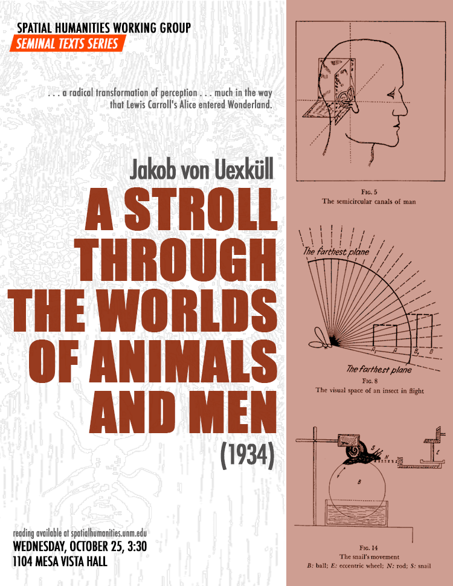
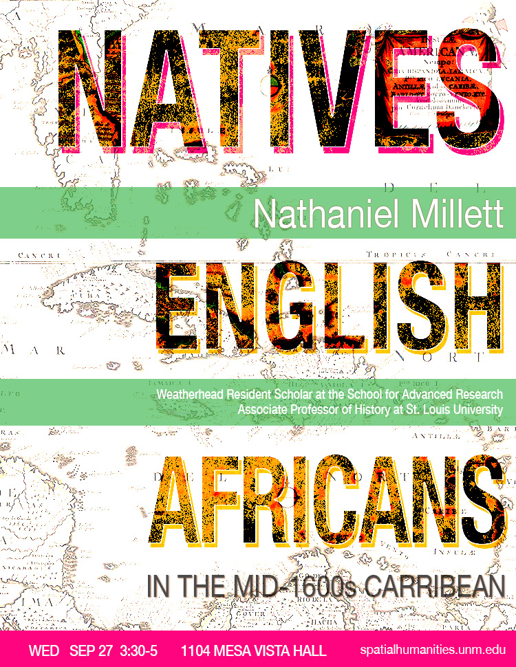
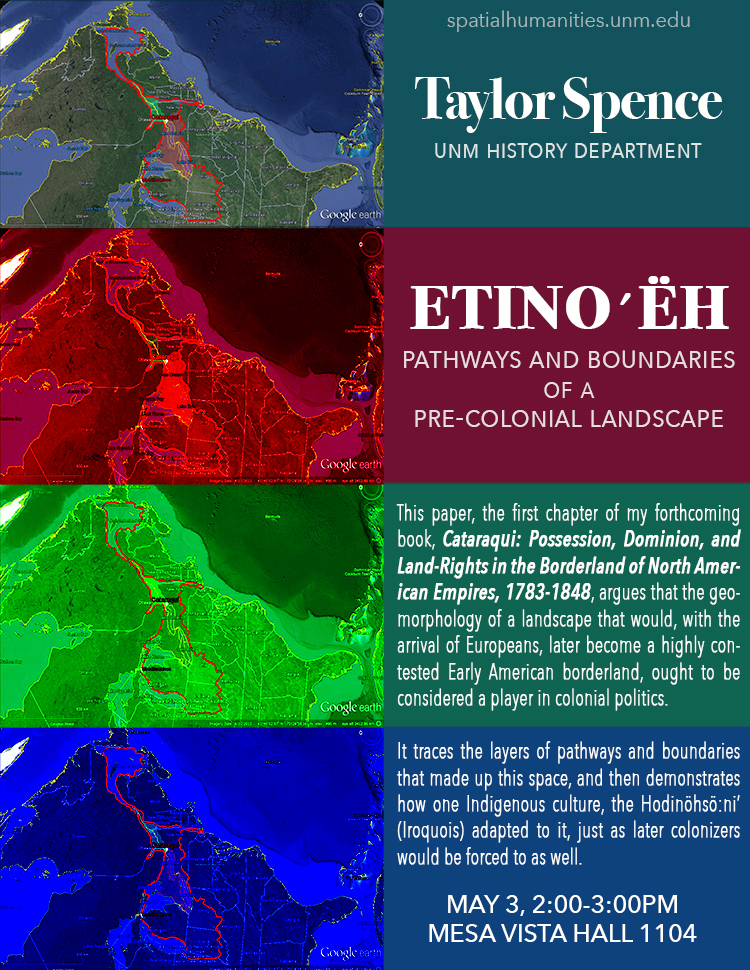
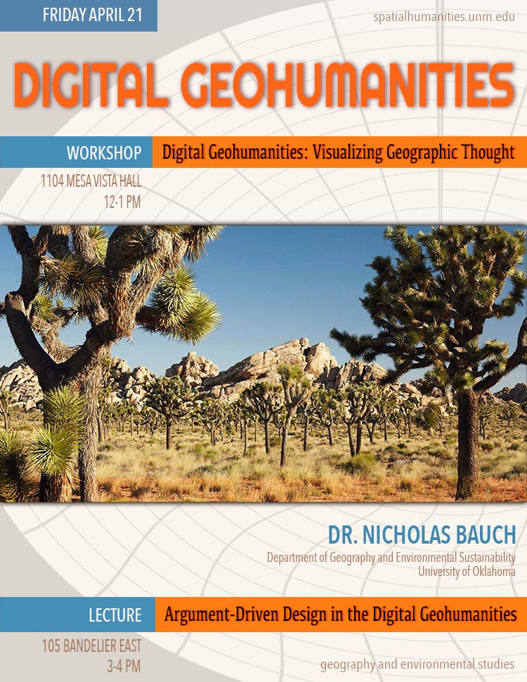
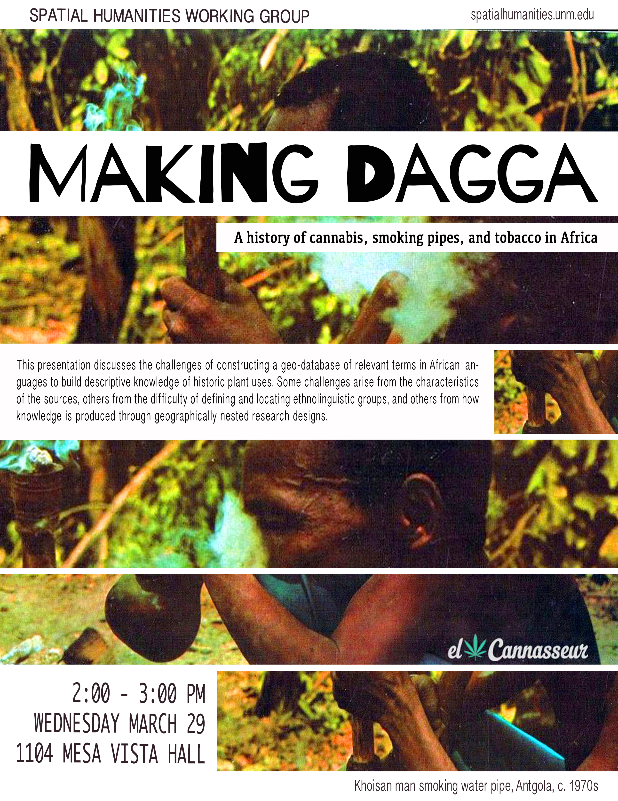

	

		<h1>Working Group Meetings</h1>
		
We meet in Mesa Vista Hall 1104 (History Department Common Room) for about an hour, but feel free to arrive late or leave early as your schedule permits. While we encourage everyone to participate in the conversation, you are more than welcome to simply hang out and listen!

		
Exact dates are listed below, but most meetings are scheduled on Wednesdays from 3:30-5pm.

	

	

		<h1>Fall 2017: Upcoming Events</h1>
	

	

	

		<h4>25 Oct 3:30</h4>
	

	

		<h2>Seminal Texts Series</h2>
		<h3>SHWG members</h3>
		

		Today we'll discuss a rather old, but still seminal text from biology that has become a core spatial humanities and post-humanist text: Jakob von Uexküll's <i>A Stroll Through the Worlds of Animals and Men</i> (1934). Inga Pollmann credits Uexküll with offering a "radical transformation of perception . . . much in the way that Lewis Carroll's Alice entered Wonderland."

		Filled with pictures and fascinating diagrams (so be not daunted by its length!) Uexküll's "stroll" will provide much food for thought and a stimulating discussion!

		[YOU CAN DOWNLOAD THE PAPER HERE](https://unmm-my.sharepoint.com/personal/tspence_unm_edu/_layouts/15/guestaccess.aspx?docid=1c6500d670b724be69f4c081b7e0a7022&authkey=AVQxyri5yVvrQvX1jU6oBw0)
		

	

	

		
	

	

	

	

		<h4>15 Nov 3:30</h4>
	

	

		<!--<h2>"Natives, English, and Africans in the mid-seventeenth century Caribbean</h2>-->
		<h3>Maria Lane, Geography and Environmental Studies, UNM</h3>
		

		

	

	

		<!---->
	

	

	

	

		<h4>06 Dec 3:30</h4>
	

	

		<!--<h2>"Natives, English, and Africans in the mid-seventeenth century Caribbean</h2>-->
		<h3>Taylor Spence, History, UNM</h3>
		

		

	

	

		<!---->
	

	

<!--
	

		<h1>Fall 2017: Previous Events</h1>
	

-->

	<h1>Previous Meetings (Spring 2017)</h1>

	

	

		<h4>27 Sep 3:30</h4>
	

	

		<h2>"Natives, English, and Africans in the mid-seventeenth century Caribbean</h2>
		<h3>Nathaniel Millett, History, St. Louis University</h3>
		

			Despite much of popular and scholarly opinion, the early modern and nineteenth century Caribbean was a tri-racial world in which native people played a prominent role alongside Europeans and Africans. This paper focuses on the role played by indigenous people in mid-seventeenth century English efforts to colonize portions of the Caribbean basin. In some cases this involved war and geopolitical machinations as English, French, Kalinagos, and Africans struggled for control of different islands. On other occasions English settlers and native people, such as the Miskitos of Central America, sought to construct relationships that were mutually beneficial. Within English colonies, many free, enslaved, and visiting native people lived and labored. This native presence within English colonies shaped laws, material culture, foodways, folk traditions, economics, and health practices. Ultimately, the early modern and nineteenth century Caribbean must be understood as a space inhabited and shaped by indigenous people to an extent that most modern observers have failed to appreciate fully.   
		

	

	

		
	

	

		

		

			<h4>03 May 2:00</h4>
		

		

			<h2>"Etinoʹëh": Pathways and Boundaries of a Pre-Colonial Landscape</h2>
			<h3>Taylor Spence, History</h3>
			

				This paper, the first chapter of my forthcoming book, <i>Cataraqui: Possession, Dominion, and Land-Rights in the Borderland of North American Empires, 1783-1848</i>, argues that the geomorphology of a landscape that would, with the arrival of Europeans, later become a highly contested Early American borderland, ought to be considered a player in colonial politics. It traces the layers of pathways and boundaries that made up this space, and then demonstrates how one Indigenous culture, the Hodinöhsö:ni’ (Iroquois) adapted to it, just as later colonizers would be forced to as well.   
			

		

		

			
		

		

		

		

			<h4>21 April 12:00</h4>
		

		

			<h3>Nicholas Bauch, University of Oklahoma</h3>
			

				Bauch will present a forthcoming work entitled, “Digital Geohumanities: Visualizing Geographic Thought,” which will appear in the <i>International Journal of Humanities and Arts Computing</i>. Our discussion will center on how digital media and geospatial analyses can contribute to cultural geographic thought.
			

		

		

			
		

		

		

		

			<h4>29 March 2:00</h4>
		

		

			<h2>"Making Dagga" and other challenges of broad-scale, descriptive research in historical geography</h2>
			<h3>Chris Duvall, GES</h3>
			

			For a short abstract: In this presentation, I will discuss my research on the history of cannabis, smoking pipes, and tobacco in Africa.  This research is based on a range of sources, including historical documents as well as biogeographic and language data.  I will focus on the challenges of building a geo-database of relevant terms in African languages, which I am using to build descriptive knowledge of historic plant uses.  Some challenges arise from the characteristics of the sources I’m using, others from the difficulty of defining and locating ethnolinguistic groups, and others from how knowledge is produced through geographically nested research designs.
			

		

		

			
		

		

		<!--
			

				

					<h4>22 February 2:00</h4>
				

				

					<h2>Landscape Forensics</h2>
					<h3>Joern Langhorst (UC-Denver) and Joni M. Palmer (UNM)</h3>
					

						Landscape forensics attempts to create a framework for multivalent, dissonant, dialogic, experimental and reflexive practices and theories. It suggests to deliberately and critically employ and assemble multiple practices, methods, media and interpretive frameworks, including the incorporation of local and non-expert knowledge. The goal is a thicker, deeper, slower and more expansive "read" that reveals the hidden, invisible and unseen, as well as allowing to make new connections within and across layers habitually separated by traditional analytical processes. These "reads" then may reveal multiple simultaneous perspectives, contestations, and conflicts over time beyond past and current hegemonies of action and interpretation, critical and central to understanding the various actors, processes, materials and agents in the production and reproduction of landscape, place and space.
					

				

				

				  
				

				

		-->

	

	

		<h4>25 January 2:00</h4>
	

	

		<h2>Development in the Ecuadorian Amazon: A Challenge to Food Sovereignty</h2>
		<h3>Jackie Kramer, Latin American Studies / GES</h3>
		

This paper addresses the environmental history of the western Amazon and its effects on the land-use practices and cultural identity of the Quichua people in Ecuador. Since the nineteenth century, two major events caused significant and rapid change on the area. First was the discovery of rubber and the subsequent rubber boom, which displaced the indigenous inhabitants as they escaped from the illegal enslavement and violence caused by the rubber barons. Second was the discovery of petroleum and its extraction, which continues to be a controversial and contentious issue. State dependency on oil extraction has placed the burden of financing social welfare programs on the lands of the indigenous peoples inhabiting the oil-rich Amazon, without benefiting those living on the land. I argue that development related to oil extraction threatens the rights to food sovereignty of the Amazonian Quichua people, and other indigenous people of the Amazon. This paper builds upon my thesis project, which examines the relationship between the constitutional right to food sovereignty in Ecuador and local food practices among the Quichua of the Ecuadorian Amazon.
		

	

	

	  
	

	

<h1>Previous Meetings (Fall 2016)</h1>

	

	

		<h4>13 December 2:00</h4>
	

	

		<h2>Teaching with Maps Workshop</h2>
		
Our final meeting for Fall 2016 will be a workshop that explores effective ways to integrate digital mapping assignments in the classroom. In particular, we will explore how to take a set of historical sources with geographic information (in this case, death certificates) and create maps that visualize them. We will work through the process of allowing students to collaboratively create a simple database that holds relevant data from historical sources, how to represent that data on a map with free mapping tools, and techniques for examining change over time via these maps. No technical skill or experience is required!

	

	

	  
	

	

	

	

		<h4>15 November 2:00</h4>
	

	

		<h2>Creating Space: The Influence of Health and Environment in Literary Walking Philosophies</h2>
		<h3>Julie Williams, English, UNM</h3>
		
Montana author Mary MacLane's “peripatetic philosophy” was influenced by the expansiveness of the Montana landscape in her early work, leading to the radicalism she expressed in her youth. Yet this relationship to the landscape and her hometown, and in turn the social critique offered in her philosophy, changes over the course of her life. Her philosophy is forcefully articulated in The Story of Mary MacLane (1902), but the ideas she championed as a young woman are presented much more cynically in her later work, a change that I argue can be connected to an illness she experienced in 1910 from which she never fully recovered, leaving her unable to traverse both her inner and outer landscapes. Her relationship with Montana and the iconic Western landscape is complex, as her childhood and young adult years spent in Butte produced not only feelings of loneliness and isolation, but also a sense of freedom from the restrictions normally placed upon women in the early twentieth century. 

	

	

	  
	

	

	

	

		<h4>18 October 2:00</h4>
	

	

		<h2>Mapping the Andean Cordillera: Land Grants and Timber under Pinochet's Welfare State</h2>
		<h3>Victor Oneschuck, History, UNM </h3>

		
From 1962 to 1973 the Chilean government instituted an agrarian reform, during which it distributed fundos (large land tracts) to rural workers. This project examines an indigenous cooperative that received 22 fundos covering approximately 1,063 square miles, only to have them sold under a subsequent military dictatorship in the 1970s and 1980s. In this talk, I examine this struggle, which is frequently framed as class conflict or interethnic conflict, via the environmental and spatial factors that shaped it.

	

	

	  
	

	

	

	

		<h4>20 September 2:00</h4>
	

	

		<h2>Crossing Borders, Tangling Tales: A New Spatial History of the Nineteenth-century World</h2>
		<h3>Sam Truett, History, UNM</h3>

		
This talk focuses on the entanglements of a nineteenth-century English sailor who drifted through maritime Southeast Asia to become a peasant villager in northern Mexico.  I use his story to anchor a nomadic, multi-scale, open-ended view of world history that transcends large-scale containers of empires, nations, and world systems.

	

	

	  
	

	

	<h1>Previous Meetings (2015-16)</h1>

	

	

		<h4>21 April 1:00</h4>
	

	

		<h2>Urban in Nature: Yosemite Valley as Metropolis, 1963-1970</h2>
		<h3>Guy McClellan, History, UNM</h3>
		
Like many places, Yosemite experienced turmoil during the late 1960s. The Valley became an approximation of city life rather than an alternative to it; complaints about traffic, noise, and air pollution made national news. When park rangers and hippies clashed on July 4, 1970, Yosemite Valley experienced another stereotypically metropolitan milestone: a riot. The Bay Area now threatened the park it helped create. To learn more about Guy's work, check out <a href="http://guymcclellan.net">his website</a>.

	

	

	  
	

	

	

	

		<h4>24 March 2:30</h4>
	

	

		<h2>Classic Readings on Space and Place</h2>
		
We will discuss several cornerstone texts in critical spatial theory.
		<ul>
		<li>Foucault, Michel. 2007. <a href="http://libproxy.unm.edu/login?url=http://site.ebrary.com/lib/unma/reader.action?ppg=176&docID=10211083&tm=1455751585105)">The language of space</a> In <i>Space, Knowledge and Power</i>, edited by Jeremy W. Crampton and Stuart Elden, 163-168. Surrey: Ashgate.</li>

		<li>Foucault, Michel. 1986. "<a href="http://libproxy.unm.edu/login?url=http://search.proquest.com/docview/1297883411/fulltext/B3C31C2C219B418FPQ/1?accountid=14613">Of other spaces</a>. <i>Diacritics</i> 16 (1):22-27.</li>

		<li>Soja, Edward W. 1995. <a href="Soja-Heterotopologies.pdf">Heterotopologies: a remembrance of other spaces in the citadel-LA</a>. In <i>Postmodern Cities and Spaces</i>, edited by Sophie Watson and Katherine Gibson, 13-34. Oxford: Blackwell.</li>
		</ul>
		

	

	

	  
	

	

	

	

		<h4>19 February 2:00</h4>
	

	

		<h3>Cameron Blevins, Rutgers University</h3>
		<h2>The Postal West</h2>
		
The integration of the American West during late nineteenth century was one of the largest reorganizations of land, resources, and people in American history. How did this integrative project take place so quickly across such a massive area of territory? "The Postal West" uses digital mapping to advance a new spatial synthesis of regional development, one that unfolded across the underlying infrastructure of the U.S. Post. Workshop participants will read and comment on a pre-circulated chapter from this ongoing book project.

	

	

	  
	

	

	

	

		<h4>11 December 1:00</h4>
	

	

		<h2>Common Readings</h2>
		
In our effort to canvas a broad range of thinking about space, this week we'll read the <a href="http://unm.eblib.com/patron/FullRecord.aspx?p=2055742">introduction and two chapters</a> from <i>The Anomie of the Earth: Philosophy, Politics, and Autonomy in Europe and the Americas.</i> Edited by Federico Luisetti, John Pickles, and Wilson Kaiser. Durham: Duke University Press, 2015.
		<ul>
		<li>Luisetti, Federico, John Pickles, and Wilson Kaiser. “Autonomy: Political Theory/Political Anthropology,” p. 1-21 (Introduction)</li>
		<li>Reyes, Álvaro, and Mara Kaufman. “Sovereignty, Indigeneity, Territory: Zapatista Autonomy and the New Practices of Decolonization,” p. 44-68 (Chapter 2)</li>
		<li>Byrd, Jodi A. “Mind the Gap: Indigenous Sovereignty and the Antinomies of Empire,” p. 119-36 (Chapter 5)</li>
		</ul>
		

	

	

	  
	

	

	

	

		<h4>20 November 1:00</h4>
	

	

		<h2>Common Readings</h2>
		

		<ul>
		<li>Lock, Gary. "<a href="http://site.ebrary.com/lib/unma/reader.action?ppg=108&docID=10767195&tm=1447282816201">Representations of Space and Place in the Humanities</a>. In <i>The Spatial Humanities: GIS and the Future of Humanities Scholarship</i>. Edited by David Bodenhamer, John Corrigan and Trevor M. Harris, 89–108. Bloomington: Indiana University Press, 2010.</li>
		<li>Gupta, Akhil, and James Ferguson. "<a href="Gupta_Ferguson.pdf">Beyond 'Culture': Space, Identity, and the Politics of Difference</a>." In <i>Culture, Power, Place: Explorations in Critical Anthropology</i>. Edited by Akhil Gupta and James Ferguson, 33–51. Durham: Duke University Press, 1997.</li>
		</ul>
		

	

	

	  
	

	

	

	

		<h4>16 October 1:00</h4>
	

	

		<h2>Common Readings</h2>
		

		The first two readings are broad discussions of spatial humanities, while the last one is a particular case study. For the Blevins reading, be sure to check out the online component, which has a detailed explanation of the interactive maps that accompany the article.
		<ul>
		<li>Ayers, Edward L. "<a href="http://libproxy.unm.edu/login?url=http://search.ebscohost.com/login.aspx?direct=true&db=e000xna&AN=642395&site=eds-live&scope=site&ebv=EB&ppid=pp_1">Turning toward Place, Space, and Time</a>." In <i>The Spatial Humanities: GIS and the Future of Humanities Scholarship</i>. Edited by David Bodenhamer, John Corrigan and Trevor M. Harris, 1–13. Bloomington: Indiana University Press, 2010.</li>
		<li>Bodenhamer, David. "<a href="http://libproxy.unm.edu/login?url=http://search.ebscohost.com/login.aspx?direct=true&db=e000xna&AN=642395&site=eds-live&scope=site&ebv=EB&ppid=pp_14">The Potential of Spatial Humanities</a>." In <i>The Spatial Humanities: GIS and the Future of Humanities Scholarship</i>. Edited by David Bodenhamer, John Corrigan and Trevor M. Harris, 14–30. Bloomington: Indiana University Press, 2010. ))</li>
		<li>Blevins, Cameron. "<a href="http://jah.oxfordjournals.org/content/101/1/122.full?ijkey=unucsImiwNrelaF&keytype=ref">Space, Nation, and the Triumph of Region: A View of the World from Houston</a>." <i>Journal of American History</i> 101, no. 1 (2014): 122–147. Don't forget the <a href="http://web.stanford.edu/group/spatialhistory/cgi-bin/site/pub.php?id=93">online component</a>.</li>
		</ul>
		

	

	

	  
	

	

